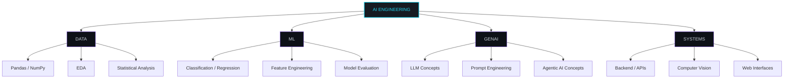

<div align="center">


<br/>

<h1>
  <b>SANIA FARHEEN I</b>
</h1>

<sub><b>AI · DATA · SOFTWARE ENGINEERING</b></sub>

<br/><br/>

<a href="https://prism-ml-portfolio.vercel.app">
  
</a>
<a href="https://www.linkedin.com/in/sania-farheen-i-32a4b3307/">
  
</a>
<a href="mailto:saniafarheenibrahim@gmail.com">
  
</a>
<a href="https://github.com/SANIA186">
  
</a>

<br/><br/>


<br/>


</div>

<br/>

## `01` ABOUT

<table>
<tr>
<td width="60%" valign="top">

I'm a B.E. Computer Science & Engineering student at **Dhaanish Chennai College of Engineering** (2023–2027, CGPA **9.27**), working across the full AI product pipeline rather than model training alone.

I don't see myself as "just" a data scientist — I build the whole chain:

```
Problem → Data → Processing → Model → Backend / API → Interface → Insights
```

Currently rotating through predictive maintenance systems, computer-vision safety tooling, and analytics dashboards — and increasingly, the backend + frontend layer that turns a model into something a real user can touch.

</td>
<td width="40%" valign="top">

```yaml
role:      Aspiring Data Analyst /
           AI-ML Engineer
based_in:  Chennai, India
focus:     AI Systems · ML · CV ·
           Data Analytics · GenAI
languages: English, Tamil, Urdu
status:    Open to internships /
           collaborative builds
```

</td>
</tr>
</table>

<br/>

## `02` KNOWLEDGE ARCHITECTURE



<br/>

## `03` ENGINEERING STACK

<div align="center">

**Languages**
<br/>


**Data & Analytics**
<br/>
 &nbsp;


**ML / Deep Learning / Vision**
<br/>
 &nbsp;


**Backend & Frontend**
<br/>


**Databases & Tools**
<br/>


**Environments / AI-Assisted Dev**
<br/>


</div>

<br/>

## `04` AI SYSTEMS LAB — MAIN PROJECTS

<sub>Each build below is treated as an engineered pipeline, not a script.</sub>

<br/>

<details open>
<summary><b>🩺 PROGNOSAI — AI-Based Predictive Maintenance System</b></summary>
<br/>

**Problem:** estimate a machine's Remaining Useful Life (RUL) from time-series sensor data, before failure happens.

```
TIME-SERIES SENSOR DATA
        │
        ▼
  DATA PREPROCESSING
        │
        ▼
  TIME-SERIES PROCESSING
        │
        ▼
   BiLSTM + ATTENTION
        │
        ▼
  RUL PREDICTION
        │
        ▼
  RISK / FAILURE ALERTS
        │
        ▼
     DASHBOARD
```

`Python` `TensorFlow` `BiLSTM` `Attention` `Streamlit` `Time-Series Data`

Built during my AI & Data Analytics internship at Infosys Springboard — uses historical sensor patterns to flag equipment risk before it becomes downtime.

</details>

<br/>

<details>
<summary><b>🦺 PPE COMPLIANCE AUDITOR — AI-Based Safety Detection System</b></summary>
<br/>

**Problem:** automatically verify whether workers on-site are wearing required safety gear.

```
CAMERA / IMAGE
        │
        ▼
  OBJECT DETECTION (YOLO)
        │
        ▼
  WORKER DETECTION
        │
        ▼
  PPE DETECTION
   (helmet · gloves · vest · boots · goggles)
        │
        ▼
  MISSING PPE IDENTIFICATION
        │
        ▼
  COMPLIANCE SCORE → RISK LEVEL → SAFETY REPORT
```

`Python` `YOLO` `OpenCV` `Ultralytics`

Outputs a live compliance score and risk level per frame, built for real safety-audit use cases rather than a detection demo.

</details>

<br/>

<details>
<summary><b>🔐 FACEGUARD — AI-Based Face Recognition Attendance System</b></summary>
<br/>

**Problem:** replace manual attendance with real-time, verified face recognition.

```
CAMERA
   │
   ▼
FACE DETECTION
   │
   ▼
FACE RECOGNITION (DeepFace)
   │
   ▼
IDENTITY VERIFICATION
   │
   ▼
ATTENDANCE PROCESSING
   │
   ▼
FLASK API  →  REACT DASHBOARD
```

`Python` `DeepFace` `Flask` `React`

Full-stack: Flask handles recognition + attendance logic, React serves the live dashboard — includes check-in/check-out flow and unknown-person flagging.

</details>

<br/>

<details>
<summary><b>📊 CUSTOMER SUPPORT TICKET ANALYTICS</b></summary>
<br/>

**Problem:** turn raw support-ticket data into decisions, not just charts.

```
RAW SUPPORT TICKETS
        │
        ▼
   DATA CLEANING
        │
        ▼
   PREPROCESSING
        │
        ▼
       EDA
        │
        ▼
   KPI ANALYSIS
        │
        ▼
  POWER BI DASHBOARD
        │
        ▼
  BUSINESS INSIGHTS
```

`Python` `Pandas` `NumPy` `Power BI`

Built during my AI Data Analyst internship at Excelerate — focused on KPI tracking and insight delivery, not just visualization.

</details>

<br/>

## `05` OTHER PROJECTS

<details>
<summary><b>Expand — additional builds</b></summary>
<br/>

| Project | What it does | Stack |
|---|---|---|
| **AI E-Commerce Fraud Detection** | Fraud detection on the IEEE-CIS dataset | `XGBoost` `ML` |
| **Car Insurance Claim Severity** | Regression model predicting claim severity | `ML` `Regression` `Model Evaluation` |
| **Salary Prediction** | Predicts salary from a large tabular dataset | `Preprocessing` `Encoding` `Linear Regression` |
| **Employee Attrition Prediction** | Predicts attrition risk, deployed as an app | `ML` `Streamlit` |
| **CareConnect Health Hub** | Role-based healthcare app concept (volunteer / doctor / pharmacist / admin) | `React` `Role-based Workflows` |

</details>

<br/>

## `06` PROFESSIONAL EXPERIENCE

**AI Data Analyst Intern** — Excelerate `Jan 2026 – Feb 2026` · Remote
Customer support ticket analytics · Python/Pandas/NumPy · data cleaning · KPI tracking · Power BI dashboards → business insights.

**AI & Data Analytics Intern** — Infosys Springboard `Oct 2025 – Dec 2025` · Remote
Predictive maintenance on time-series sensor data · BiLSTM + Attention · RUL prediction. Shipped **PrognosAI**.

<br/>

## `07` CERTIFICATIONS / LEARNING

<table>
<tr><td width="50%" valign="top">

**Structured Learning**
- Infosys Springboard — AI Learning Path (12+ credentials)
- NPTEL — Joy of Computing in Python
- NPTEL — Database Management Systems

</td><td width="50%" valign="top">

**Job Simulations & Courses**
- Forage — GenAI Powered Data Analytics Job Simulation
- Deloitte — Data Analytics Job Simulation
- Ntech — Data Analytics
- NumPy · Pandas · MongoDB · React · Oracle Cloud · Cisco AI

</td></tr>
</table>

<br/>

## `08` ACHIEVEMENTS & ACTIVITIES

<table>
<tr><td width="50%" valign="top">

**Achievements**
- 🏆 Best Student of the Year — 2024
- 🌟 Innovate for Impact — Impactis recognition (₹50,000 award)

</td><td width="50%" valign="top">

**Beyond the Terminal**
- 📷 Photography
- 🏸 Tennikoit
- 🔥 Cook Without Fire
- 🎺 Band troupe leadership

</td></tr>
</table>

<br/>

## `09` CURRENT FOCUS

```text
> strengthening backend + API layers under existing ML models
> exploring agentic AI / LLM-integrated application design
> shipping more full-stack AI products end-to-end
```

<br/>

## `10` GITHUB SIGNALS

<div align="center">


</div>

<sub>Note: if the streak card above doesn't render for your account, remove this block rather than replace it with a broken widget — GitHub stats images are third-party and occasionally rate-limited.</sub>

<br/>

## `11` SYSTEM EASTER EGG

<div align="center">

──────────── 🐍 SNAKE ARENA ────────────

**[▶ PLAY SNAKE](https://www.google.com/logos/2022/googlesnake/snake_desktop_en.html)**

<sub>"Take a break from debugging."</sub>

────────────────────────────────────────

</div>

<br/>

<details>
<summary><sub>🔧 Optional: turn your real contribution graph into a snake (GitHub Actions)</sub></summary>
<br/>

You can generate an animated snake that eats your own contribution graph using the [`platane/snk`](https://github.com/Platane/snk) GitHub Action. Once set up, it produces an SVG you can embed here instead of (or alongside) the link above — it replaces the fake/decorative version with one built from your real activity.

</details>

<br/>

## `12` CONTACT

<div align="center">

<a href="mailto:saniafarheenibrahim@gmail.com">
  
</a>

<br/><br/>

<sub>Analyze data → Build ML models → Build AI applications → Connect to backend/API → Create usable interfaces</sub>

<br/><br/>


</div>
